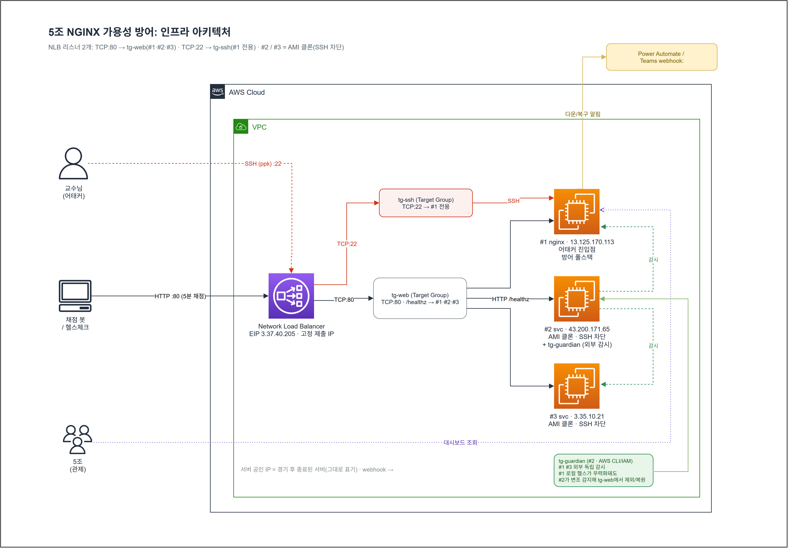
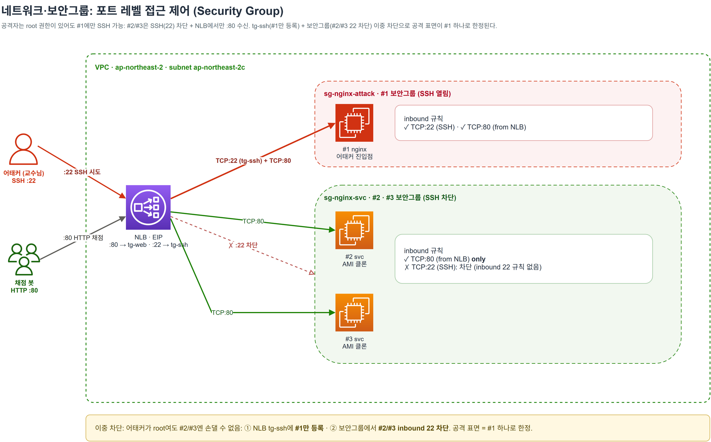

# ① 아키텍처

> NginX 살려라 A/D CTF · **교육용·방어 전용**. 서버 공인 IP는 경기 후 종료(그대로 표기) · webhook은 마스킹.

## 토폴로지

- **NLB (EIP)** · 채점·제출 대상. 리스너가 **2개**입니다:
  - `TCP:80` → 타겟그룹 **`tg-web`** (#1·#2·#3 전부) · 서비스/채점 트래픽. HTTP `/healthz`로 각 백엔드 건강 확인.
  - `TCP:22` → 타겟그룹 **`tg-ssh`** (**`#1`만** 등록) · SSH는 네트워크 구조상 `#1`로만 유입됩니다.
- **백엔드 3대**
  | 노드 | SSH | 역할 |
  |---|---|---|
  | `#1` | **open** | 어태커 진입점. 방어·모니터링 풀스택 탑재 |
  | `#2` · `#3` | **차단** | `#1`의 AMI 클론. nginx만 서빙(공격 표면 최소화) |

## 설계 의도

공격자(교수)가 SSH로 **`#1`에만** 들어올 수 있는 건 우연이 아니라 **설계입니다**. NLB의 `TCP:22` 리스너가 `#1`만 등록된 `tg-ssh`로 포워딩하므로 `#2`/`#3`엔 SSH 경로 자체가 없습니다(+ 보안그룹에서도 차단). 그 위에 가용성을 두 겹으로 지킵니다:

1. `#1`은 [다층 자동복구](02-defense-in-depth.md)로 **죽어도 자동 복구를 시도**합니다.
2. 그래도 `#1`이 오염되면 [**스스로 헬스체크에서 빠져**](03-healthcheck-failover.md) NLB가 정상인 `#2`/`#3`로 우회합니다.

→ 단일 지점(`#1`)이 집중 공격을 받아도 **NLB 뒤의 서비스 가용성은 유지**됩니다. 실제로 2차 공격(80 포트 하이재킹) 때 이 우회로 무중단을 유지했습니다.

## 네트워크·보안그룹

SSH가 `#1`로만 들어오는 건 tg-ssh(타겟그룹)뿐 아니라 **보안그룹(SG)** 에서도 강제됩니다. `#2`/`#3`은 inbound `TCP:22` 규칙 자체가 없습니다.

| 보안그룹 | 대상 | inbound 22 (SSH) | inbound 80 (HTTP) |
|---|---|---|---|
| `sg-nginx-attack` | `#1` | ✓ (어태커 진입점) | ✓ from NLB |
| `sg-nginx-svc` | `#2`·`#3` | **차단** | ✓ from NLB only |

→ **이중 차단**(tg-ssh에 `#1`만 등록 + SG에서 `#2`/`#3` 22 차단)으로 공격 표면이 `#1` 하나로 한정됩니다.

---

관련: [② 다층 방어](02-defense-in-depth.md) · [④ 관측·감시](04-monitoring.md) · [스크립트](../scripts/README.md)
