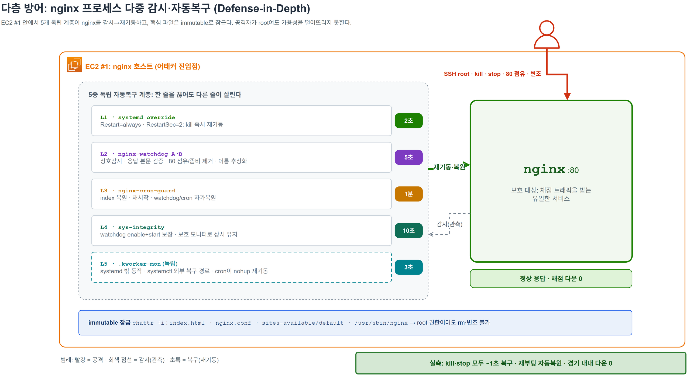
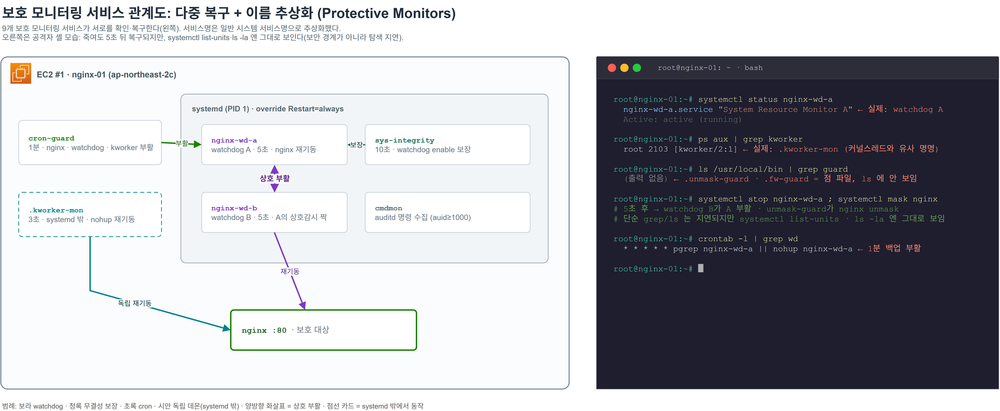

# ② 다층 방어 (Defense-in-Depth)

> 교육용·방어 전용. 규칙상 공격자를 차단할 수 없으므로, 전략은 **"죽여도 되살아나는 그물망"**.



## 5중 자동복구

각 계층은 서로 독립적입니다. 공격자가 한 라인을 무력화해도 다른 라인이 복구합니다.

| 계층 | 메커니즘 | 구현 | 주기 |
|---|---|---|---|
| ① | `systemd Restart=always` | [`nginx-override.conf`](../scripts/systemd/nginx-override.conf) | 2초 |
| ② | watchdog A·B 상호감시 | [`nginx-watchdog.sh`](../scripts/bin/nginx-watchdog.sh) | 5초 |
| ③ | cron guard | [`nginx-cron-guard.sh`](../scripts/bin/nginx-cron-guard.sh) | 1분 |
| ④ | 무결성 보장기 | [`sys-integrity.sh`](../scripts/bin/sys-integrity.sh) | 10초 |
| ⑤ | 독립 모니터 | [`kworker-mon.sh`](../scripts/bin/kworker-mon.sh) | 3초 |

### ① systemd 자가복구

```ini
# /etc/systemd/system/nginx.service.d/override.conf
[Unit]
StartLimitIntervalSec=60
StartLimitBurst=20

[Service]
Restart=always
RestartSec=2
```

`kill` 당해도 systemd가 2초 내 재기동합니다. `StartLimit*`은 **`[Unit]` 섹션 키**입니다, systemd 229+에서 `[Service]`에 두면 "Unknown key"로 무시되므로 위치가 중요합니다. 60초당 20회까지 재기동을 허용해 반복 kill에는 공격적으로 되살아나되, 깨진 바이너리가 무한 크래시 루프로 CPU를 태우는 것은 막습니다. 한도를 넘겨 systemd가 잠시 멈추면 watchdog(5초)·cron(1분)이 `reset-failed` 후 복구를 이어받습니다.

### ② watchdog A·B · 응답 본문으로 판정

프로세스 생존이 아니라 **응답 본문(h1)**으로 살아있는지 봅니다. 살아있지만 페이지가 오염/응답불가인 경우까지 잡기 위해서입니다.

```bash
http_ok() { curl -s -m 3 http://127.0.0.1:80/ 2>/dev/null | grep -q "$NEEDLE"; }
```

80 포트를 nginx가 아닌 프로세스(apache 등)나 좀비가 점유하면 제거하고, A와 B가 **서로를 살립니다**. 한쪽을 죽여도 다른 쪽이 부활시킵니다.

### ⑤ 독립 모니터 (.kworker-mon)

systemd **밖에서** `nohup`으로 돌아 `systemctl`에 의존하지 않는 복구 경로를 하나 더 확보합니다. 커널 스레드(`kworker`)와 비슷한 이름·dotfile로 단순 탐색 비용을 늘리지만, root가 `ps`로 보면 드러나므로 보안 경계로 의존하지는 않습니다. cron이 죽으면 다시 띄웁니다.

## 보호 모니터링 서비스 관계도 · 다중 복구 + 이름 추상화

워치독 2개 + 모니터링 서비스 9개, 총 11개의 보호용 백그라운드 서비스가 서로의 상태를 확인하고 복구합니다. 한둘을 죽여도 다른 경로가 복구를 시도하지만, **root 공격자가 이들을 한 번에 제거하면 메시도 무너집니다**. 보안 경계가 아니라 복구 확률·속도를 높이는 다중화입니다.



- **상호 복구**: watchdog A·B가 서로를 확인·복구(5초), cron(1분)·sys-integrity(10초)가 그 둘을 보장하고, watchdog과 독립 `.kworker-mon`이 nginx를 재기동 → 한둘을 죽여도 다중 경로로 복구를 시도합니다.
- **이름 추상화**: systemd `Description`·서비스명을 일반적인 시스템 서비스명(예: `nginx-wd-a` → "System Resource Monitor")·dotfile로 둡니다. **실무 보안 기법이 아니라** CTF 환경에서 단순 탐색 비용을 늘리는 보조 수단이며, `systemctl list-units`·`ls -l /proc/<pid>/exe`로는 그대로 드러납니다.
- **특수 대응 서비스**: `.unmask-guard`(mask 해제)·`.fw-guard`(iptables 복원)·`.tamper-alert`(변조 webhook)·`cmdmon`(명령 수집)이 이벤트별로 동작합니다.

## immutable 플래그 (chattr +i)

```bash
chattr +i /var/www/html/index.html \
          /etc/nginx/sites-available/default \
          /usr/sbin/nginx
```

`chattr +i`는 **root를 막지 못합니다**. root는 `chattr -i` 한 줄로 풉니다. 목적은 **비root·실수·단순 변조 방지**와, 변조에 한 단계 비용을 부과해 감사 로그에 흔적을 남기는 것입니다. 단, **헬스체크용 `ok` 파일은 일부러 잠그지 않습니다** → [③ 헬스체크 페일오버](03-healthcheck-failover.md) 참고.

## 무결성·이상 점검 (stealth-check)

상시 복구 데몬과 별개로, 시스템 무결성과 공격자 흔적을 한 번에 훑는 점검기 [`stealth-check.sh`](../scripts/bin/stealth-check.sh)를 두었습니다. 낯선 enabled 서비스(예: 어태커가 깐 `apache2`·`ssl-cert`), `ld.so.preload`/`profile.d` 주입, nginx 설정·`index.html` 원본 일치 여부 등을 점검합니다.

> 

---

관련: [① 아키텍처](01-architecture.md) · [⑤ 공격 타임라인](05-attack-timeline.md)
