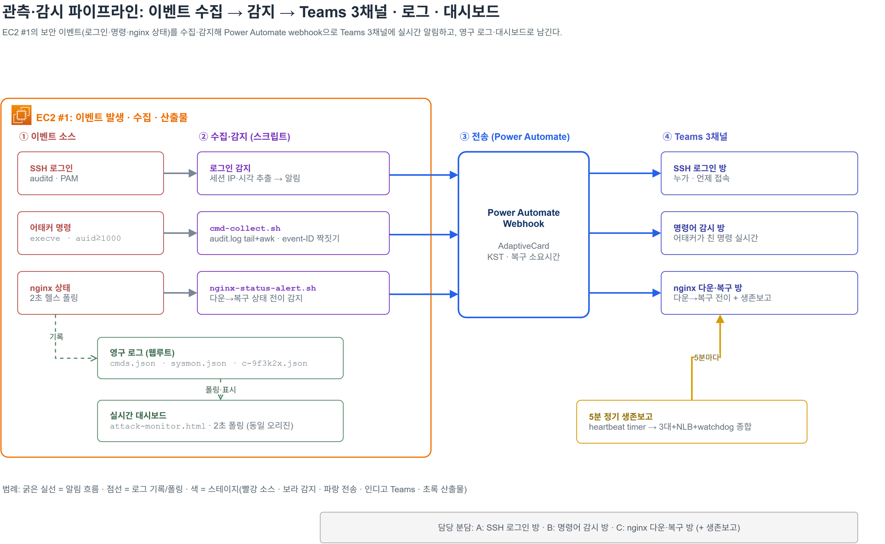

# ④ 관측·감시

> 교육용·방어 전용. webhook URL은 마스킹(`<REDACTED_WEBHOOK_URL>`)됨.



## 명령 추적 파이프라인

auditd가 공격자 명령을 잡고 → `cmd-collect`가 파싱 → 대시보드 / Teams로 흐릅니다.

### auditd 룰 · '사람 명령'만

```
-a exit,always -F arch=b64 -S execve -F auid>=1000 -F auid!=4294967295 -k attacker_cmd
```

`auid>=1000` 필터가 핵심입니다. 이게 빠지면 데몬(시스템) 명령까지 전부 잡혀 로그가 노이즈에 묻힙니다. 실제로 "명령 로그 0개"처럼 보였던 버그의 원인이었습니다. ([attacker.rules](../scripts/audit/attacker.rules))

### cmd-collect · event-ID 짝짓기

`ausearch` 전체 스캔 대신 `audit.log` 최근 줄만 `tail` → `awk`로 **EXECVE(명령)**와 **SYSCALL(auid·tty)**를 같은 event-ID로 짝지어 파싱합니다. 부하를 낮추면서 "누가 친 명령인지"까지 복원. pts→SSH IP 매핑으로 명령 주인을 식별하고, webhook 노출 명령은 `[알림 전송]`으로 가립니다. ([cmd-collect.sh](../scripts/bin/cmd-collect.sh))

## 산출물

- `cmds.json` (명령, 1초) · `sysmon.json` (자원·세션·방어상태, ~3초) · `c-9f3k2x.json` (접속 이력)
- 대시보드 `attack-monitor.html` · 같은 nginx가 서빙하는 **동일 오리진** JSON(`cmds.json`·`sysmon.json`)을 주기적으로 폴링해 브라우저에서 실시간 갱신 (동일 오리진이라 CORS 제약 없음)

> **실시간 관제 대시보드 (`#1` 시스템)**: 접속자·서버 자원·5중 방어 상태·모니터링 서비스 9개·명령 로그를 한 화면에 모았습니다. 어태커 접속이 감지되면 상단 배너로 경고합니다. (공인·개인 IP 마스킹)
>
> 

> **서버 자원 모니터 (`#1`)**: `sysmon.json`(3초) 기반 CPU·메모리·디스크·로드 + 무거운 프로세스 Top. 방어·모니터링 서비스가 과부하로 도리어 서버를 죽이지 않는지 감시합니다.
>
> 

## Teams 3채널 + webhook

- **3개 방으로 분리** · SSH 로그인 / 명령어 / nginx 다운·복구
- 상태 전이(다운→복구) 순간에만 AdaptiveCard 발사(KST, 복구 소요시간)

```bash
# nginx-status-alert.sh — 상태가 바뀌는 순간에만 webhook POST
curl -s -m 5 -X POST "$WEBHOOK" -H "Content-Type: application/json" -d @- << JSON ...
```

- **5분 정기 생존보고** (`nginx-heartbeat.timer` → `nginx-heartbeat.sh`): 3대 + NLB + watchdog 종합 점검

> **실제 발사된 알림(Teams/webhook).** 사람이 화면을 못 보는 새벽에도 상태 변화가 즉시 푸시됐습니다.
>
> | 변조 감지 | 다운 → 복구 (2초) | 5분 정기 생존보고 |
> |:---:|:---:|:---:|
> |  |  |  |
> | `index.html` h1 변조 즉시 감지 → NLB 격리 안내 | nginx 다운 감지 후 **2초** 만에 복구 완료 | 5분마다 NLB·#1·#2·#3·watchdog 종합 보고 |

---

관련: [⑤ 공격 타임라인](05-attack-timeline.md) · [⑥ 동맹·불침번](06-alliance-nightwatch.md) · [스크립트](../scripts/README.md)
